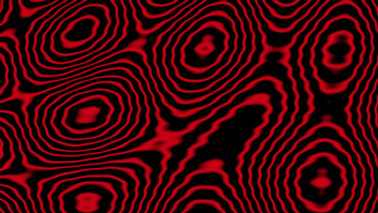
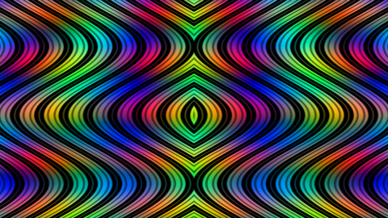
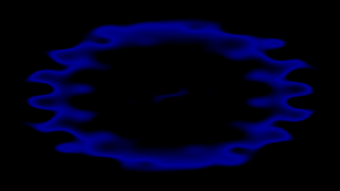

# I made some weird animations in WebGL

Run the animations in your browsers [here](https://erkaman.github.io/posts/regl_anim.html)

Using the WebGL framework
[regl](https://github.com/mikolalysenko/regl), I made some weird
animations. All of them are basically just using trigonometric
functions to create patterns in a fragment shader. Check out the
source code if you are interested.

<table><thead>
</thead><tbody>

<tr>
<td align="center"></td>
</tr>
<tr>
<td align="center"> <a href="source">vines.js</a></td>
</tr>

<tr>
<td align="center"></td>
</tr>
<tr>
<td align="center"> <a href="source">rainbow.js</a></td>
</tr>

<tr>
<td align="center"></td>
</tr>
<tr>
<td align="center"> <a href="source">circle.js</a></td>
</tr>

</tbody></table>


## Build

To run the animations locally on your computer, first change your directory to the directory of the project, then run

```bash
npm install
```

To then run the animations `circle`, do

```bash
npm run circle
```

The other animations are named `rainbow` and `vines`
